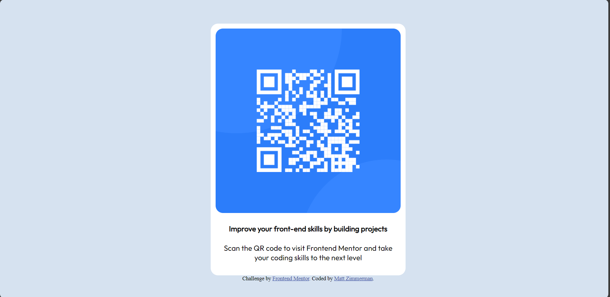

# Frontend Mentor - QR code component solution

This is a solution to the [QR code component challenge on Frontend Mentor](https://www.frontendmentor.io/challenges/qr-code-component-iux_sIO_H). Frontend Mentor challenges help you improve your coding skills by building realistic projects. 

## Table of contents

- [Overview](#overview)
  - [Screenshot](#screenshot)
  - [Links](#links)
- [My process](#my-process)
  - [Built with](#built-with)
  - [What I learned](#what-i-learned)

## Overview

### Screenshot

### Links

- Solution URL: [https://github.com/MattZim2000/qr-code-component-main](https://github.com/MattZim2000/qr-code-component-main)
- Live Site URL: [https://mattzim2000.github.io/qr-code-component-main/](https://mattzim2000.github.io/qr-code-component-main/)

## My process
This was a fairly straightforward project. I modified the HTML and then added a CSS sheet to match the designs
### Built with

- Semantic HTML5 markup
- CSS custom properties
- Flexbox
